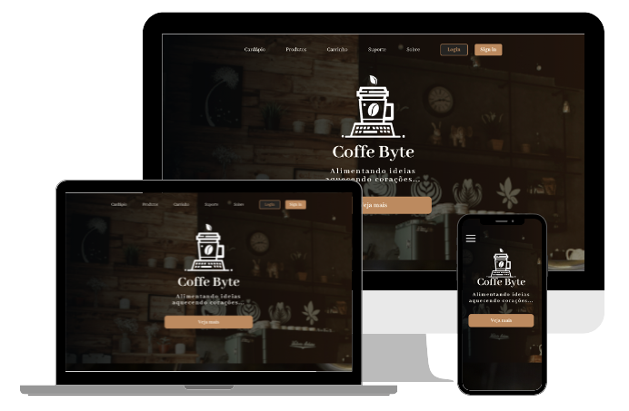

<h1 align="center"> Coffe Byte - Porque não misturar café com código?</h1>

  

<h2>Coffe Byte ☕💻</h2>

 Coffe Byte é um projeto que combina o aconchego de uma cafeteria com a inovação da tecnologia. Este site foi projetado para oferecer uma experiência envolvente e moderna para os amantes de café, apresentando informações sobre produtos, serviços e promoções da cafeteria.
 

<h3>✨ Visão Geral</h3>

O site Coffee Byte apresenta:

<ul>
    <li>Um design responsivo e intuitivo para facilitar a navegação em dispositivos móveis e desktop.</li>
    <li>Uma interface elegante, com tons que remetem à sofisticação e aconchego do café.</li>
    <li>Informações completas sobre os produtos disponíveis, incluindo bebidas, comidas e itens especiais.</li>
    <li>Seções interativas para promoções, reservas e contato.</li>
    
</ul> 

<h3>🎯 Objetivo do Projeto</h3>

O objetivo do Coffe Byte é oferecer um site onde os usuários possam conhecer
melhor sobre a cafeteria e adquirir seus produtos e acessórios.

 

<h3> 🚀 Funcionalidades</h3>

<ul> 
    <li>Página inicial com detalhes sobre a cafeteria e localização.</li>
    <li>Sistema de login e sign-in.</li>
    <li>O usuário deve ter uma conta para ter acesso as seções de cardápio, produtos e acessórios.</li>
    <li>Sistema de carrinho, adicionar ou remover produtos e conferir o total da compra.</li>
    <li>Possibilidade de adicionar ou remover mais de 1 mesmo produto ao carrinho.</li>
    <li>Página de fundadores, história dos fundadores da cafeteria.</li>
    <li>Página de suporte, onde é possível entrar em contato com a equipe e relatar problemas ou sugestões de melhorias. </li>

</ul>

<h3> 🛠️ Tecnologias Utilizadas</h3>

 

